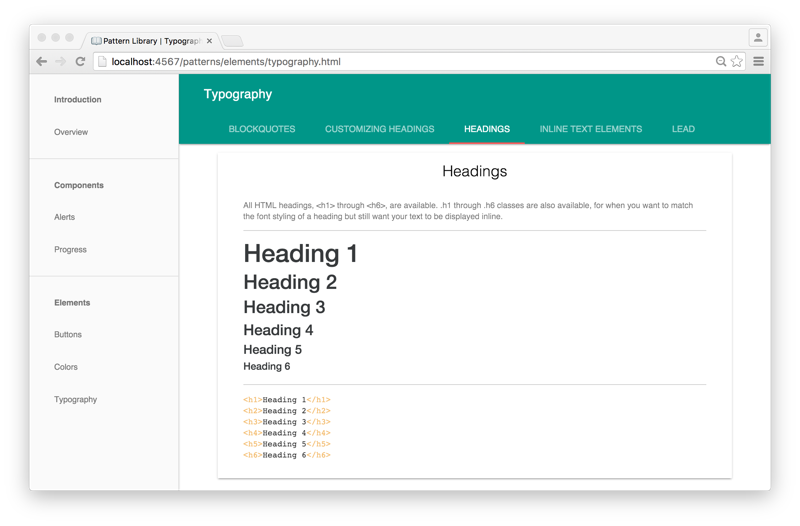

# middleman-pattern-library

**middleman-pattern-library** is a [Middleman 4.x](http://middlemanapp.com)
project template for creating and managing your front-end pattern library.



## Installation

Create a new project with the template:

```bash
$ middleman init -T danielbayerlein/middleman-pattern-library MY_PROJECT_FOLDER
```

## Usage

Start a local web server running at `http://localhost:4567/` with:

```bash
$ bundle exec middleman server
```

For help, see the official [Middleman](http://middlemanapp.com) website.

## Contributing

1. Fork it
2. Create your feature branch (`git checkout -b my-new-feature`)
3. Commit your changes (`git commit -am 'Add some feature'`)
4. Push to the branch (`git push origin my-new-feature`)
5. Create new [Pull Request](../../pull/new/master)

## Copyright

Copyright (c) 2016 Daniel Bayerlein. See [LICENSE](./LICENSE.md) for details.
